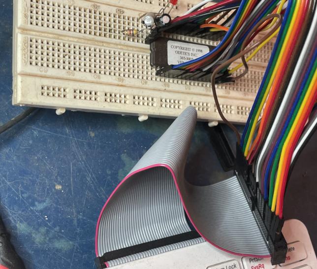

# EPROM (27C010) reader for Raspberry Pi

Tested on a pi400.

Inspired by https://www.instructables.com/Raspberry-Pi-Python-EEPROM-Programmer/

See https://hackaday.io/project/182779-late-90s-gps-time-unit-repair-1024-week-bug-fix/log/201888-reverse-engineering-first-steps for context

Rough diagram of pinout:

Photo of quick and dirty circuit on connected to Pi400:

